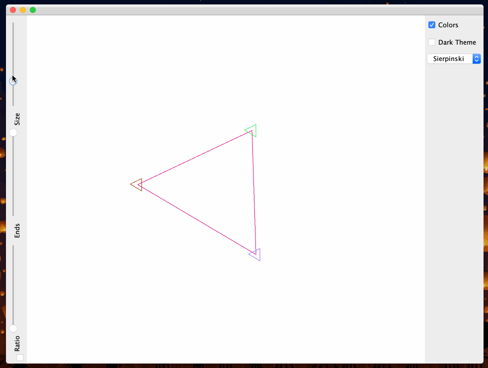

## Description
This is a showcase of fractals and how varying their certain features changes their appearances. The inspiration to create it came purely out of the love to experiment with new things. What started as a single drawing of a tree evolved into this and I eventually decided to submit it as the final project for the course of _Object Oriented Programming_ at the end my second semester

## How to Run
Install a recent version of JDK and `cd` to the cloned folder. Run `make` if you have [make](https://www.gnu.org/software/make/) installed.  

If you do not have `make` installed, run the following commands one by one.

```bash
javac ./FractalArt/*.java
javac Main.java
java Main
```

## The Animations in Action

### Tree 


### Star


### Sierpinski

_The circular slider has been custom made from scratch._
